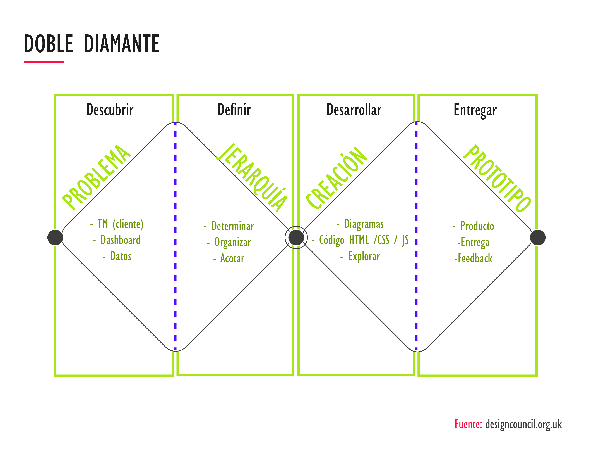
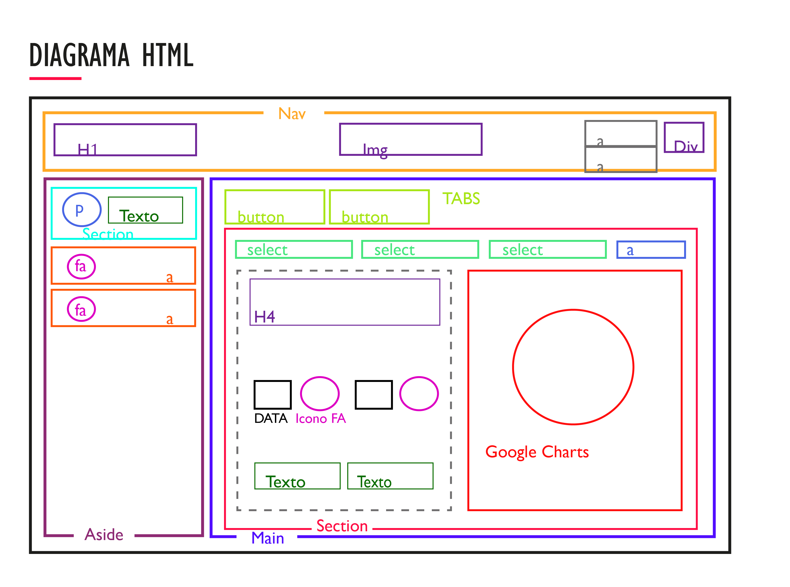
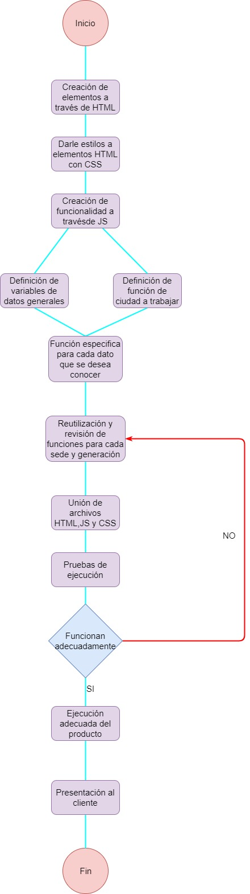

# Data Dashboard

* **Track:** _Common Core_
* **Curso:** _Creando tu primer sitio web interactivo_
* **Unidad:** _Producto final_

***

## Proceso
#### Metodología Doble Diamante

En este proyecto trabajaremos una metodología Doble Diamante, la cual consiste en 4 etapas que describimos en un gráfico a continuación:

## Estructura de HTML:

1. Nuestra web esta conformada por **3 secciones** principales:

  1. **El _Nav_**: Menú de navegación principal. Elemento de texto del lado izquierdo con el título de la página web. Centrado el identificador (logo) de Laboratoria. Flotado del lado derecho, un menú hamburguesa con utilidades desplegables: Idioma / Log-out

  2. **El menú lateral _Aside_**: Sección donde se encuentran los datos generales del usuario (nombre, correo electrónico, foto de perfil). En la parte inferior dos secciones: Configuración; que vincula a una vista que captura los datos. Cerrar sesión; enlace que al dar click vinculará en la home page de www.laboratoria.la

  3. **La sección principal _Main_**: Sección que funciona con 2 visualizaciones por medio de Tabs.

    a. **_"INFORMACIÓN"_:** despliega por medio de 2 _<select_> los datos (Data vinculada desde _Javascript_), por Ciudades y por Generaciones.
    A un costado de los _select_, tenemos un vínculo _<a_> _"VER PROFESORES"_ que nos lleva a la parte del documento en que se muestran los puntajes dados a Profesores y Jedi.

    b.** _"ESTUDIANTES"_:** Pestaña en la cual tenemos una visualización de los datos generales de las alumnas. Igualmente se despliega por medio de 2 _<select_> por generación y ciudad, y un vínculo _<a_> _"VER PROFESORES"_ que nos lleva a la parte del documento en que se muestran los perfiles de Profesores y Jedi.

## Desarrollo del proyecto

Para este producto finalse deberá analizar la problemática que presenta un TM de Laboratoria por lo que se debe enerne r cuenta todos los datos con los que trabajan ellos.

**Primero**

Se realizará el maquetado del proyecto una vez que haya sido aceptado por el cliente, con los estilos adecuados que maneja Laboratoria y con el material incluido en el repositorio

**Posteriormente**

En cuanto al JS se realizará el siguiente proceso:

1. Se declararán todas la variables necesarias para el proyecto(datos solicitados por el cliente)
2. Realizar una función que incluya los datos de CDMX
3. Con esta crearemos los procesos para sacar los datos de alumnas por generación
4. También crearemos funciones para saber el total de alumans que siguen estudiando en Laboratoria
5. Estas funciones las reutilizaremos para cada una de las sedes y generaciones existentes en Laboratoria

**Por último**

Se juntará la parate de maquetado con la de funcionalidad para que el producto funcione adecuadamente y así poder presentarlo al cliente.

## Diagrama de flujo

